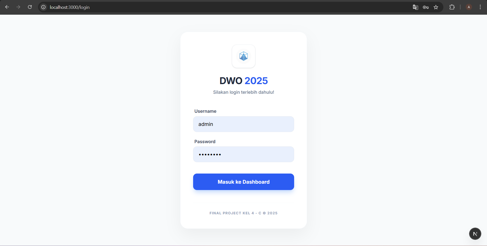
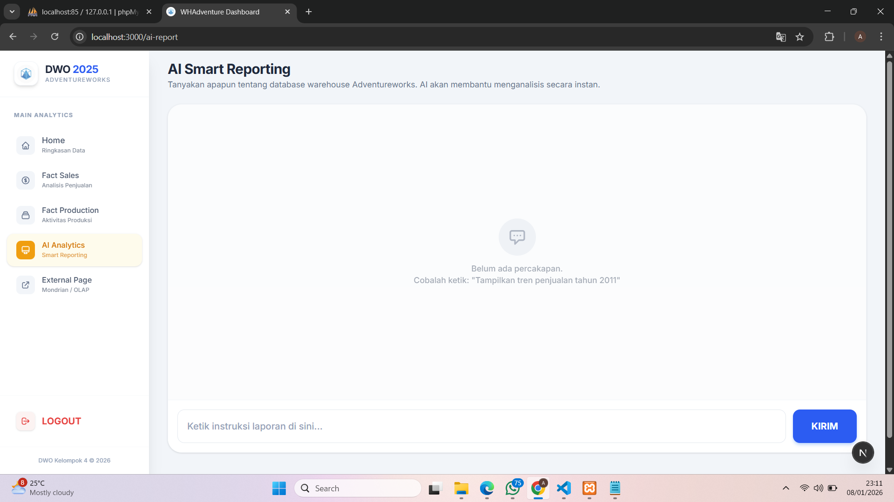

# 📊 AdventureWorks Data Warehouse & OLAP



>📌 Proyek ini dikembangkan sebagai **Final Project Mata Kuliah Data Warehouse dan OLAP**, dengan fokus pada pembangunan Data Warehouse AdventureWorks, implementasi analisis OLAP, dashboard analitik, serta asisten cerdas berbasis AI untuk mendukung analisis data historis multidimensi dan data-driven decision making pada domain **Sales dan Production**.

---

## 🎯 Tujuan Proyek
- Membangun skema **Data Warehouse AdventureWorks**
- Mengimplementasikan **OLAP Cube** menggunakan Mondrian
- Menyediakan aplikasi web untuk eksplorasi data Sales dan Production
- Mendukung analisis data historis secara cepat dan terstruktur

---

## 🛠️ Teknologi yang Digunakan
- **Next.js** – Frontend Framework (React)
- **Node.js** – JavaScript Runtime
- **MySQL** – Database Server  
- **Apache (XAMPP)** – Web Server  
- **Apache Tomcat** – Application Server  
- **Mondrian** – OLAP Engine  
- **phpMyAdmin** – Database Management  

---

## 🚀 Fitur Utama
- **Integrated ETL:** Skema data yang optimal hasil transformasi dari sistem operasional ke sistem warehouse. 
- **Drill-down Analytics:** Kemampuan melihat detail data dari level kategori hingga level produk spesifik.
- **OLAP Dashboard:** Visualisasi interaktif untuk data penjualan dan produksi.
- **AI Smart Reporting:** Asisten analitik berbasis AI (Ollama) yang mampu menjawab pertanyaan natural language dan menghasilkan visualisasi chart secara instan.

---

## ⚙️ Panduan Instalasi & Konfigurasi

### 1️⃣ Persiapan Lingkungan dan Konfigurasi Database
1. Pastikan sudah terinstall **XAMPP**
2. Pastikan modul **Apache**, **MySQL**, dan **Tomcat** tersedia
3. Pastikan LLM **llama3.2** tersedia
4. Jalankan Ollama di cmd dengan cara `ollama run llama3.2`
5. Gunakan **phpMyAdmin** untuk pengelolaan database
6. Jalankan Apache dan MySQL melalui XAMPP Control Panel
7. Akses phpMyAdmin melalui:
```
http://localhost/phpmyadmin
```
6. Buat database baru dengan nama `whadventure`
7. Import file `whadventure.sql` (tersedia pada folder **olap_database/database**)

### 2️⃣ Konfigurasi Mondrian OLAP
1. Salin file `mondrian.war` ke:
```
xampp/tomcat/webapps
```
2. Salin file `mysql-connector-java-5.1.4-bin.jar` ke dalam:
```
xampp/tomcat/webapps/mondrian/WEB-INF/lib
```
3. Salin seluruh file dari `olap_database/mondrian-files/WEB-INF/queries` ke `xampp/tomcat/webapps/mondrian/WEB-INF/queries`
4. Salin seluruh file dari `olap_database/mondrian-files/mondrian` ke `xampp/tomcat/webapps/mondrian`

### 3️⃣ Konfigurasi Backend (API endpoint)
1. Masuk ke direktori back-end
```
cd back-end
```
2. Buat file .env dan sesuaikan kredensial database Anda:
```
DB_HOST=localhost
DB_USER=root
DB_PASS=
DB_NAME=whadventure
OLLAMA_URL=http://127.0.0.1:11434/api/generate
AI_MODEL=llama3.2:3b
```
3. Jalankan perintah:
```
npm install
node index.js
```

### 4️⃣ Menjalankan Dashboard
1. Masuk ke direktori front-end (Next.js).
```
cd front-end
```
2. Buat file .env
```
NEXT_PUBLIC_API_BASE=http://localhost:4000
NEXT_PUBLIC_OLAP_SALES_URL=http://localhost:8080/mondrian/testpage.jsp?query=factsales
NEXT_PUBLIC_OLAP_PRODUCTION_URL=http://localhost:8080/mondrian/testpage.jsp?query=factproduction
NEXT_PUBLIC_AI_ENDPOINT=http://localhost:4000/api/ai/chat
```
3. Jalankan perintah:
```
npm install
npm run dev
```
4. Akses aplikasi melalui browser di `http://localhost:3000`
5. Informasi Login
  - Username: admin
  - Password: admin123 


